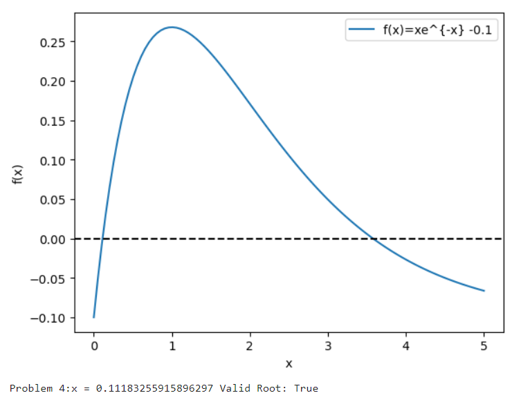

# JupyterLab3.github.io
<!DOCTYPE html>
<html lang="en">
<head>
    <meta charset="UTF-8">
    <meta name="viewport" content="width=device-width, initial-scale=1.0">
    <title>Mastering JupyterLab</title>
    
</head>
<body>

    <nav>
        
🚀 LearnJupyter

        

        

    </nav>

    <section class="hero">
        

            <h1>Master Data Science with JupyterLab</h1>
            
Go from absolute beginner to writing interactive Python code, building data visualizations, and managing notebooks like a pro.

            <a href="https://ayana-sarkar.github.io/Home2.github.io/" class="btn">Basic</a>
         <a href="https://ayana-sarkar.github.io/JupyterLab4.github.io/" class="btn">Plotting with List</a>
        <a href="https://ayana-sarkar.github.io/JupyterLab5.github.io/" class="btn">Plotting with Arrays</a>
        <a href="https://ayana-sarkar.github.io/JupyterLab2.github.io/" class="btn">Interpolation</a>
        

    </section>

    <section id="curriculum" class="curriculum">
            

                <h2>1. Interface & Setup</h2>
                
Install Anaconda, launch JupyterLab, and master the left sidebar, file browser, and tabbed layouts.

            

            

                <h2>2. Cells & Markdown</h2>
                
Grlding certification (like LEED etc) systems to ensure adherence to 
                sustainable building standards and performance criteria

            

            

                <h2>3. Keyboard Shortcuts</h2>
                
Speed up your workflow drastically using Command and Edit modes, cell execution shortcuts, and deletions.

            

            

                <h2>4. Data & Visuals</h2>
                
                
Import CSVs, run Pandas operations, and render beautiful Matplotlib/Seaborn plots directly inside your notebook.

               
            

        

    </section>

</body>
</html>
